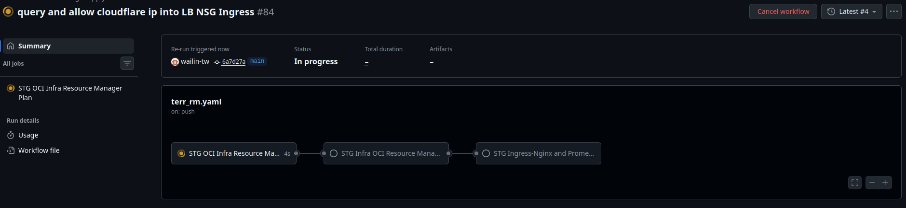
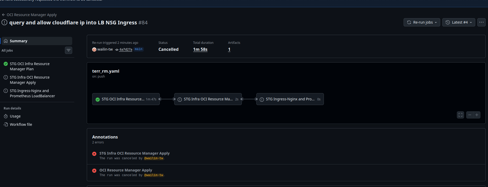
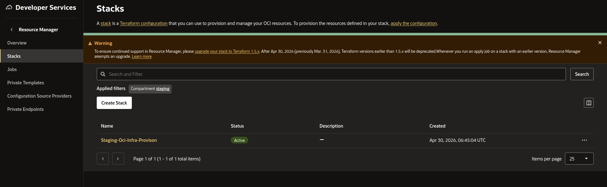
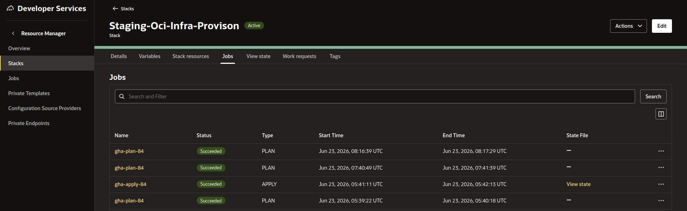
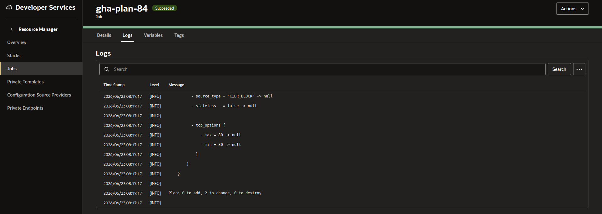
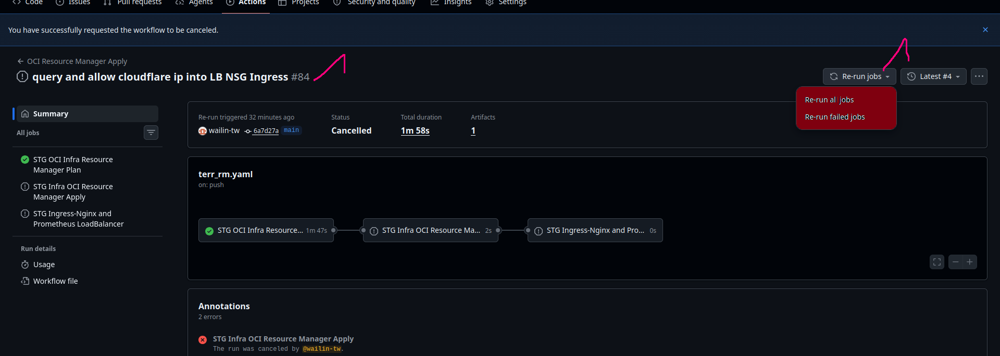

# Provision STG OCI Infrastucture

## Compartments

1. mgmt
    - log analytics, log group, key vault, etc

2. app
    - OKE, workers nodes, Instances, etc

3. data
    - Database, Redis, Block Storage, etc

4. network
    - STG VCN
        - All subnets, Network Security Group, security list, route tables,etc

## VCN, Subnet and IP

VCN_NAME = **stg** 

VCN_CIDR = **10.30.0.0/16**

1. public_lb_subnet = **( 10.30.0.0/24 )**

<!-- 2. cms_oke_woker_subnet = **( 10.10.16.0/20 )**

3. cms_oke_pod_subnet = **( 10.10.128.0/20 )**

4. web_oke_worker_subnet = **( 10.10.30.0/20 )**

5. web_oke_pod_subnet = **( 10.10.112.0/20 )** -->

2. worker_subnet = **( 10.30.96.0/20 )**

3. pod_subnet = **( 10.30.144.0/20 )**

4. db_subnet = **( 10.30.80.0/24 )**

5. private_k8s_api_endpoint_subnet = **( 10.30.60.0/24 )**

6. private_lb_subnet = **( 10.30.55.0/24 )**


## Notifications

### If there's any changes on **Subnets**, **Security List**, **Network Security Group**, **Route Table**, automatically sent alerts to email. Check it out ***notification.tf***


## GitHub Action Workflow


## Requirement for GHA workflow

***In Repository Secrets,*** need to create the following secrets.

**BASTION_SSH_PRIVATE_KEY**

**BASTION_USER**

**OCI_FINGERPRINT** 

**OCI_PRIVATE_KEY**

**OCI_REGION**

**OCI_TENANCY_OCID**

**OCI_USER_OCID**


***In Repository Variables,*** need to create the following variables.

**STACK_ID**

    this stack_id is what you want to trigger from Github Action to OCI Resoure Manager.

 

## Example of create OCI Resource Manger Configuration Source Providers and Stack

- Integrate with github for ***Configuration Source Providers***
- Create ***stack*** with specific repo with the above created ***Configuration Source Providers***

## OKE Architecture

<!--  -->

1. Bastion Host can access every cluster.
2. Bastion Host can access ssh connection to all worker nodes.
3. Use Native OCI CNI Plugin.
4. Cluster Auto Scaler Add-on.
5. Cert-Manager Add-on. ( In this case, cert-manager is installed becasuse this is dependency for Metric Server Add-on)
6. Metric Server Add-on.

## Github Action Workflow and Terraform
- In GHA, there are three total stages.
  - First stage trigger ***Terraform Plan***. (***STG OCI Infra Resource Manager Plan***)
  - Second stage trigger ***Terraform Apply***. (***STG OCI Infra Resource Manager Apply***)
  - Third Stage create **Prometheus Stack** and **Ingress-nginx** inside OKE  Cluster. (***STG Ingress-Nginx and Prometheus LoadBalancer***)

    

- Code change whatever you want in ***terraform files***.
- Push code to ***main*** branch.
  ```
   git add .

   git commit -m "xxxxx"

   git push origin main
  ```
- ( **Very Important** , **Be Careful** ) When you push code to main, ***Github Action*** workflow will trigger terraform plan. As soon as Plan Stage success, immediately ***Cancel*** Workflow for ***REVIEW CODE CHANGES***

  
  

- Go to ***Resource Manager*** from OCI Console.
    - Check Job file first. This is like **Terraform Plan** file.
    - ***Resource Manager*** can be found under ***Staging*** Comparment.

      
      
      

- If ***Plan Jobs*** is exactly what you want, you can ***Apply this Plan*** file.
    - For ***Apply Jobs***, you don't need to push again. 
    - Go to **Github Action** from console and ***Re-run jobs*** => ***Re-run all jobs***

        

    - Always check, Github Action Workflow number and **gha-plan-(x)** and **gha-apply-(x)**. In this case, ***84***

      

## Grafana, Nginx and Promethues
- Grafana server is created using ***docker-compose.yaml***. You can find this file under **scripts/packages.sh**.
- Nginx Proxy Server setup using manaully for grafana **SSL/TLS**. 
  ```
  https://grafana.sandbox.airborneo.com
  ```
- Prometheus server is running inside OKE , **monitoring** namespace. 
- **Grafana** connect with **Prometheus** using **Internal Loadbalancer** fron **monitoring** namespace.

# Important Note
- **IF YOU WANT TO ***DRIFT DETECTION*** WITHOUT CODE CHANGES, YOU CAN RE-RUN LATEST WORKFLOW AND CHECK PLAN JOBS. DON'T FORGET TO CANCEL WORKFLWO AFTER PLAN STAGE SUCCESS.**
